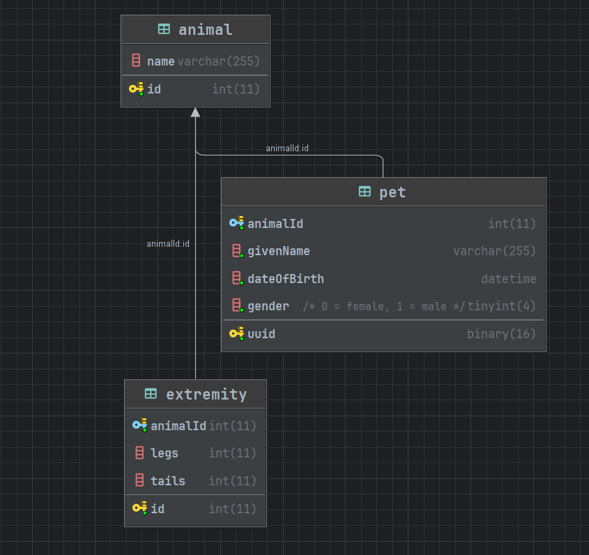

# Simple MySQL tasks

## Instructions
Clone/Fork the repository and execute the setup.sql locally to achieve the following database structure

## Hacktoberfest
Feel free to register with [hacktoberfest](https://hacktoberfest.com/) to make this count as a contribution.

## Go to [tasks](Tasks.md) to solve the challenges

Please submit your pull requests with your answers in the folder `/participants` in the format ***your-username***.sql
Your queries must execute without errors against MySQL and yield the correct results. 